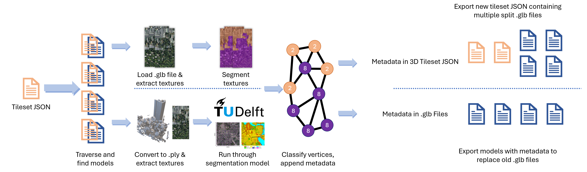

# Segmentation Pipeline for glTF in 3D Tiles

This repository was developed as a proof of concept for a pipeline for **semantic segmentation** of [glTF](https://github.com/KhronosGroup/glTF) models contained within [3D Tiles](https://github.com/CesiumGS/3d-tiles).



### ✨ Features

-   **Texture-based semantic segmentation** of glTF models
-   Support for glTF, glb as well as **[Draco](https://github.com/google/draco) compressed** glb
-   **3D Tiles conversion** based on [py3dtiles](https://gitlab.com/Oslandia/py3dtiles)
-   Extraction of 3D Tiles by **bounding box** or **region of interest**

# ⚙️ Installation

## ⚠️ Requirements

-   Python 3.9 or higher
-   (Recommended) [CUDA](https://developer.nvidia.com/cuda-downloads) and [cuDNN](https://developer.nvidia.com/cudnn) for GPU acceleration
-   (Optional) Node.js for the webserver: Refer to [the webserver README](webserver/README.md) for more information
-   (Optional) Unity v2022.3.5f1
-   `pip install -r requirements.txt`

## ⚡ Quickstart

To run the segmentation pipeline, run the following command:

```bash

python pipeline.py --file <tileset-file-name> --input <input-directory> --output <output-directory>

```

For instance, if your directory structure looks like this:

```
.
├── pipeline.py
├── input/
│   ├── tileset.json
│   └── model.glb
└── output/
```

Run the following command:

```bash

python pipeline.py --file tileset.json --input input/ --output output/

```

The pipeline will output a segmented .glb file containing the metadata of the class of each vertex in the model.

# 🔧 Usage

## Tileset Extractor

With a large tileset, having a smaller, selected area of region will significantly reduced the pipeline processing time. The [`extract_tileset.py`](./extract_tileset.py) script can be used to extract a specific branch of a tileset by specifying either the target file name or the latitude and longitude bounds of the region of interest.

### By Filename

To select a specific branch of the tileset by specifying the target file name, the `--search-name` argument can be specified.

```bash

python extract_tileset.py --file <tileset-file-name> --input <input-directory> --output <output-directory> --search-name <target-file-name>

```

Upon finding the target file, the script will isolate the branch the target file is on and exports the extracted branch to the output directory. Parent tilesets will be modified to contain only the specific child that is within the branch.

### By Lat Long

Alternatively, to extract by latitude and longitude bounds, the `--bounds` argument can be specified instead.

```bash

python extract_tileset.py --file <tileset-file-name> --input <input-directory> --output <output-directory> --bounds <lat_1> <lon_1> <lat_2> <lon_2>

```

The script will search for tiles and checks if the centre of the bounding box of the tile is within the given bounds. If the tile is within the bounds, the tile will be exported to the output directory. Parent tilesets will be modified to contain only the specific child that is within the bounds.

### With Neighbours

To extract the target tile and its neighbours, the `--neighbours` argument can be specified.

```bash

python extract_tileset.py --file <tileset-file-name> --input <input-directory> --output <output-directory> --search-name <target-file-name> --neighbours

```

The neighbours of the tile containing the target file will be kept in the extracted tileset.

## GLB Segmentation

Allows the segmentation of a .glb file into either a single .glb file containing metadata or into multiple .glb files split by class.

```bash

python glb/segment.py --file <glb file path> --output <output-directory>

```

To split by class, include the `--submeshes` argument.

Refer to the [.glb segmentation README](./glb/README.md#segmentpy) for more information.

## Pipeline

The pipeline thereby consists of the following steps:

1. **Tileset Traversal** - Traverses the tileset and retrieves the .glb file of each tile
2. **GLB Segmentation** - Segments each .glb file into a single .glb file containing metadata

If the option to split by class is enabled with the inclusion of the `--submeshes` argument, the pipeline will have the following steps instead:

1. **Tileset Traversal** - Traverses the tileset and retrieves the .glb file of each tile
2. **GLB Segmentation** - Segments each .glb file into multiple .glb files split by class
3. **3D Tiles Conversion** - Exports a converted 3D Tileset with the necessary labels

If the pipeline is interrupted, restarting the pipeline will automatically resume from where it left off, by checking if the output file already exists.
